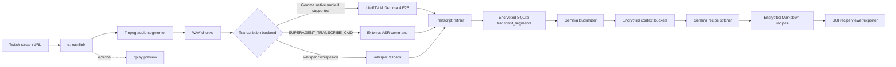
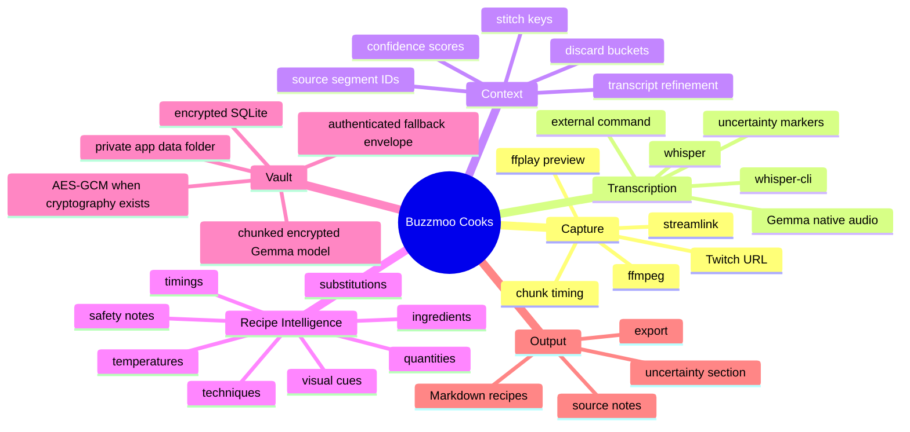
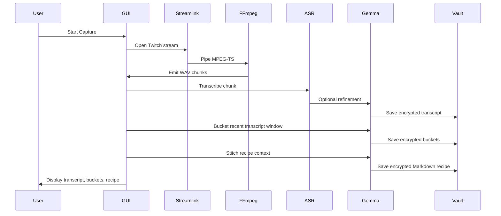
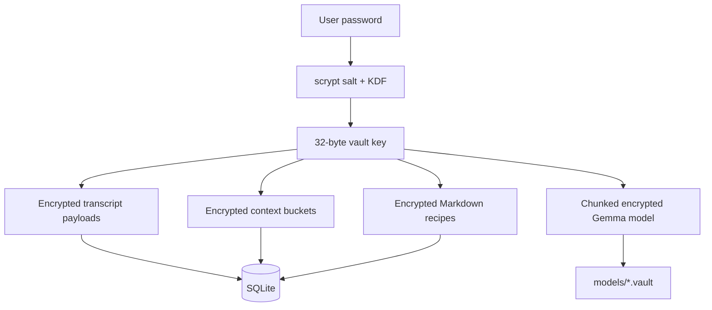

# Buzzmoo Cooks

Buzzmoo Cooks is an advanced desktop SuperAgentLLM app that turns a live Twitch cooking stream into an encrypted local recipe vault. It pulls audio from Twitch, chunks it with FFmpeg, transcribes the chunks, asks Gemma 4 E2B / LiteRT-LM to refine and bucket the stream context, then stitches those buckets into Markdown recipes you can inspect and export.

Default stream:

```text
https://www.twitch.tv/buzzmoo_au
```

## One-Line Install

Linux:

```bash
curl -fsSL https://raw.githubusercontent.com/ornab74/buzzmoo_cooks/main/install/linux.sh | bash
```

macOS:

```bash
curl -fsSL https://raw.githubusercontent.com/ornab74/buzzmoo_cooks/main/install/macos.sh | bash
```

Windows PowerShell:

```powershell
irm https://raw.githubusercontent.com/ornab74/buzzmoo_cooks/main/install/windows.ps1 | iex
```

Override the install folder:

```bash
BUZZMOO_COOKS_DIR="$HOME/Apps/buzzmoo_cooks" curl -fsSL https://raw.githubusercontent.com/ornab74/buzzmoo_cooks/main/install/linux.sh | bash
```

## Quick Start

1. Launch the app.
2. Click **Unlock / Create Vault** and create a local password.
3. Click **Download / Seal Gemma** to download `gemma-4-E2B-it.litertlm`, verify its SHA256, and seal it into the encrypted local model vault.
4. Keep the default Twitch URL or enter another Twitch channel URL.
5. Click **Start Capture**.
6. Watch **Live Transcript**, **Context Buckets**, and **Markdown Recipes** fill as chunks are processed.

The app stores data under:

```text
.superagent_data/
```

Set `BUZZMOO_RECIPES_HOME` before launch to move the encrypted vault elsewhere. The app also accepts the older `BUZZMO_RECIPES_HOME` spelling.

## Architecture



## Agent Mindmap



## Processing Sequence



## Installers

The install scripts do the boring but important bits:

- install or verify `git`, Python, Tk support, and FFmpeg/FFplay
- clone or fast-forward update `github.com/ornab74/buzzmoo_cooks`
- create `.venv`
- install pinned Python requirements from `requirements.txt`
- compile-check `main.py`
- write a launcher

Linux launcher:

```bash
~/buzzmoo_cooks/run.sh
```

macOS launcher:

```bash
open ~/buzzmoo_cooks/run.command
```

Windows launcher:

```powershell
powershell -ExecutionPolicy Bypass -File "$HOME\buzzmoo_cooks\Start-BuzzmooCooks.ps1"
```

## Requirements

Pinned direct Python packages live in `requirements.txt`.

System dependencies:

- Python 3.10-3.13 recommended
- Tkinter
- Git
- FFmpeg and FFplay
- Streamlink, installed from pinned PyPI package

LiteRT-LM notes:

- The app imports `litert_lm`.
- Current pinned package is `litert-lm-api-nightly==0.11.0.dev20260422`.
- At this pinned build, wheels are available for Linux x86_64, Linux aarch64, and macOS arm64.
- Windows users can run the app natively with Whisper/external transcription; for Gemma-native LiteRT inference, WSL is the safer route.

## Transcription Backends

Backend order:

1. Gemma native audio through LiteRT-LM, when your installed wheel/model supports audio input.
2. `SUPERAGENT_TRANSCRIBE_CMD`, an external command that prints transcript text.
3. `whisper-cli`, if available.
4. `whisper`, from `openai-whisper`.

External command example:

```bash
export SUPERAGENT_TRANSCRIBE_CMD='whisper "{audio}" --model base --language en --fp16 False --output_format txt --output_dir /tmp && cat /tmp/$(basename "{audio}" .wav).txt'
```

## Vault And Security Model



The app uses `cryptography` AES-GCM when installed. If `cryptography` is missing, it can still run with an authenticated stdlib fallback envelope, but the pinned installer installs `cryptography` so the normal mode is AES-GCM.

## Repo Map

```text
main.py                  # GUI, encrypted vault, Twitch pipeline, Gemma agent
requirements.txt         # pinned direct Python runtime deps
install/linux.sh         # Linux one-line installer target
install/macos.sh         # macOS one-line installer target
install/windows.ps1      # Windows one-line installer target
README.md                # this guide
```

## Advanced Environment Variables

```text
BUZZMOO_COOKS_DIR        install location used by install scripts
BUZZMOO_REPO_URL         alternate git repo URL for forks
BUZZMOO_RECIPES_HOME     runtime vault/model/chunk storage directory
BUZZMO_RECIPES_HOME      accepted legacy spelling for the same runtime directory
SUPERAGENT_TRANSCRIBE_CMD external ASR command; {audio} expands to WAV chunk path
SUPERAGENT_WHISPER_MODEL whisper model name for fallback, default base
SUPERAGENT_WHISPER_LANGUAGE whisper language, default en
```

## Troubleshooting

Missing `ffplay`:

```bash
ffplay -version
```

Missing Tkinter on Linux:

```bash
sudo apt-get install python3-tk
```

No Gemma model:

Use **Download / Seal Gemma** inside the app. The model is downloaded from the LiteRT community Hugging Face repo, checked against the pinned SHA256 in `main.py`, and sealed into `.superagent_data/models`.

Twitch capture works but no transcript:

- install Whisper or set `SUPERAGENT_TRANSCRIBE_CMD`
- confirm chunks appear under `.superagent_data/chunks`
- check **Agent Console** inside the GUI

Windows Gemma-native inference:

Use WSL and the Linux installer when you need the LiteRT-LM Python API. Native Windows can still use Twitch capture, FFmpeg, encrypted storage, and Whisper/external transcription.

## Development

```bash
python3 -m venv .venv
. .venv/bin/activate
python -m pip install --upgrade --pre -r requirements.txt
python -m py_compile main.py
python main.py
```

The code is intentionally single-file for local portability, but the runtime architecture is modular inside `main.py`: `EncryptedRecipeStore`, `GemmaAgent`, `Transcriber`, `TwitchPipeline`, and `SuperAgentApp`.
